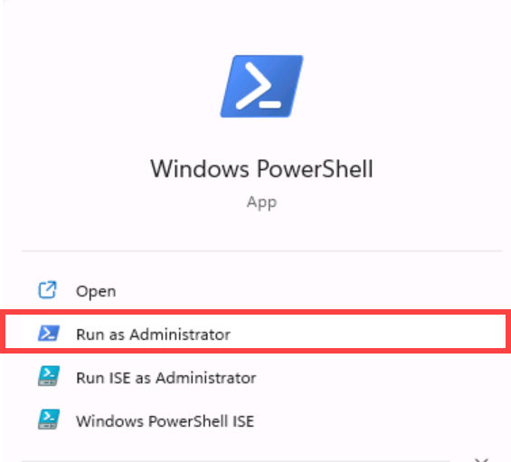
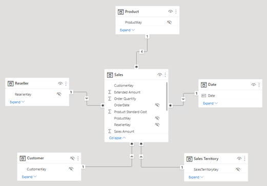
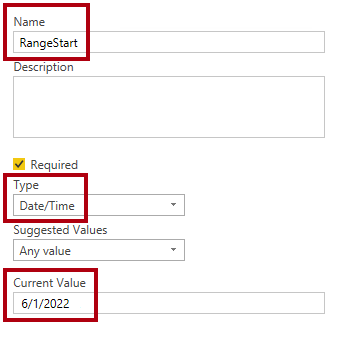
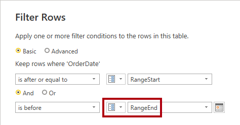

---
lab:
    title: 'Improve performance with hybrid tables'
    module: 'Optimize enterprise-scale tabular models'
---

# Improve performance with hybrid tables

## Overview

**The estimated time to complete the lab is 45 minutes**

In this lab, you will set up incremental refresh and enable a DirectQuery partition to deliver real time updates and improve refresh and query performance.

In this lab, you learn how to:

- Set up incremental refresh.

- Review table partitions.

## Get started

In this exercise, you will prepare your environment.

### Clone the repository for this course

1. On the start menu, open the Command Prompt.

    

1. In the command prompt window, navigate to the D drive by typing:

    `d:` 

   Press enter.

    

1. In the command prompt window, enter the following command to download the course files and save them to a folder called DP500.
    
	`git clone https://github.com/MicrosoftLearning/DP-500-Azure-Data-Analyst DP500`
   
1. When the repository has been cloned, close the command prompt window. 
   
1. Open the D drive in the file explorer to ensure the files have been downloaded.
### Deploy an Azure SQL Database 

In this task, you'll create an Azure SQL database that you'll use as a data source for Power BI. Running the setup PowerShell script will create the Azure SQL database server and load the AdventureWorksDW2022 database.

1. To open File Explorer, on the taskbar, select the **File Explorer** shortcut.

	

2. Go to the **D:\DP500\Allfiles\10** folder.

3. Double click to open the **setup2.ps1** file script.
    - Read through the script in notepad if you're interested in understanding what resources the script is setting up. The lines beginning with # denote what the script is doing.
    - Close the script.

5. In the search box on the taskbar, type `PowerShell`.  When the search results appear, select **Run as administrator**

	- If prompted, select Yes to allow this app to make changes to your device.
6. In PowerShell, enter the following text to run the script. 
	- ` cd D:\DP500\Allfiles\10 .\setup2.ps1`
	- Press **Enter**.
7. When prompted, enter your Azure account username, password, and resource group. Press enter. The script will take approximately 10-15 minutes to run.
    *Note: This lab requires a resource group to create an Azure SQL database. If you do not have a resource group provided in a hosted lab environment, [create a resource group](https://docs.microsoft.com/azure/azure-resource-manager/management/manage-resource-groups-portal#create-resource-groups) in your Azure subscription.*
8. After the script has completed, close the PowerShell window.

### Set up the Azure SQL Database

In this task, you will set up the Azure SQL Database to allow connections from your virtual machine's (VM's) IP address. This script will take about 10 minutes to run after you enter your username, password, and resource group.

1. In a web browser, go to [https://portal.azure.com](https://portal.azure.com/).

2. If prompted to take a tour, select **Maybe later**.

	

3. Select the **SQL databases** tile.

	

4. In the list of SQL databases, select the **AdventureWorksDW2022-DP500** database.

5. In the action bar on the Overview tab, select **Set server firewall**.

	

6. In the firewall settings, select **Add client IP**.

	

7. Select **Save**.

	

8. Keep the Azure portal web browser session open. You will need to copy the database connection string in the **Set up Power BI Desktop task**.

### Set up the Power BI service

In this task, you will sign in to the Power BI service and start a trial license.

*Important: If you have already setup Power BI in your VM environment, continue to the next task.*

1. In a web browser, go to [https://powerbi.com](https://powerbi.com/).

2. Use the lab credentials to complete the sign in process.

3. At the top-right, select the profile icon, and then select **Start trial**.

	

4. When prompted, select **Start trial**.

	

	*You require a Power BI Premium per User (PPU) license to complete this lab. A trial license is sufficient.*

5. Do any remaining tasks to complete the trial setup.

	*Tip: The Power BI web browser experience is known as the **Power BI service**.*

### Create a workspace

In this task, you will create a workspace.

1. In the Power BI service, to create a workspace, in the **Navigation** pane (located at the left), select **Workspaces**, and then select **Create workspace**.

	

2. In the **Create a workspace** pane (located at the right), in the **Workspace name** box, enter a name for the workspace.

	*The workspace name must be unique within the tenant.*

	

3. Beneath the **Description** box, expand open the **Advanced** section.

	

4. Set the **License mode** option to **Premium per user**.

	

	*Power BI only supports incremental refresh and hybrid tables in Premium workspaces.*

5. Select **Save**.

	

	*Once created, the Power BI service opens the workspace. You will return to this workspace later in this lab.*

### Set up Power BI Desktop

In this task, you will open a pre-developed Power BI Desktop solution, set the data source settings and permissions, and then refresh the data model.

1. To open File Explorer, on the taskbar, select the **File Explorer** shortcut.

	

2. Go to the **D:\DP500\Allfiles\10\Starter** folder.

3. To open a pre-developed Power BI Desktop file, double-click the **Sales Analysis - Improve performance with hybrid tables.pbix** file.

4. To edit the database data source, on the **Home** ribbon tab, from inside the **Queries** group, select the **Transform data** dropdown, and then select **Data source settings**.

	

5. In the **Data source settings** window, select **Change Source**.

	

6. In the **SQL Server database** window, in the **Server** box, replace the text with the lab Azure SQL Database server. This is located in the Azure portal, SQL databases.

    

7. Select **OK**.

	

8. Select **Edit Permissions**.

	

9. In the **Edit Permissions** window, to edit the database credentials, select **Edit**.

	

10. In the **SQL Server database** window, enter the SQL Server database username and password. 

    Username: `sqladmin`

    Password: `P@ssw0rd01`

    

11.  Select **OK**.
    

12. In the **Data source settings** window, select **Close**.

	

13. On the **Home** ribbon tab, from inside the **Queries** group, select the **Transform data** dropdown, and then select **Refresh**.

	

14. Wait until the data refresh completes.

15. To save the file, on the **File** ribbon tab, select **Save as**.

16. In the **Save As** window, go to the **D:\DP500\Allfiles\10\MySolution** folder.

17. Select **Save**.

18. If you're not already signed in, at the top-right corner of Power BI Desktop, select **Sign In**. Use the lab credentials to complete the sign in process.

	*Important: You must use the same credentials used to sign in to the Power BI service.*

	

### Review the report

In this task, you will review the pre-developed report.

1. In Power BI Desktop, review the report design.

	

	*The report page has a title and two visuals. The slicer visual allows filtering by a single fiscal year, while the bar chart visual displays monthly sales amounts. In this lab, you will improve the performance of the report by setting up incremental refresh and a hybrid table.*

### Review the data model

In this task, you will review the pre-developed data model.

1. Switch to **Model** view.

	

2. Use the model diagram to review the model design.

	

	*The model comprises five dimension tables and one fact table. Each table uses import storage mode. The **Sales** fact table represents sales order details. It's a classic star schema design.*

	*In this lab, you will set up the **Sales** table to use incremental refresh and become a hybrid table. A hybrid table includes a DirectQuery partition that represents the latest time period. That partition ensures current data from the data source is available in Power BI reports.*

## Set up incremental refresh

In this exercise, you will set up incremental refresh.

*Incremental refresh extends scheduled refresh operations by providing automated partition creation and management for dataset tables that frequently load new and updated data. It helps to reduce refresh time, placing lower burdens on source data and Power BI. It can also help surface current data to Power BI report more quickly.*

### Add parameters

In this task, you will add two parameters.

1. To open the Power Query Editor window, on the **Home** ribbon tab, from inside the **Queries** group, click the **Transform data** icon.

	

2. In the Power Query Editor window, from inside the **Queries** pane, select the **Sales** query.

	

3. In the preview pane, notice the **OrderDate** column, which is a date/time column.

	*Incremental refresh requires that the table contain a date column of date/time or integer data type with the value formatted as yyyymmdd.*

	*To setup incremental refresh, you must create parameters that Power BI will use to filter this column to create table partitions.*

4. To create a parameter, on the **Home** ribbon tab, select the **Manager Parameters** icon.

	

5. In the **Manage Parameters** window, select **New**.

	

6. In the **Name** box, replace the text with **RangeStart**.

7. In the **Type** dropdown list, select **Date/Time**.

8. In the **Current Value** box, enter **6/1/2022** (June 1, 2022 - the VM uses US date formats).

	*While setting up the parameters, you can use an arbitrary values. Power BI will update parameter values when it creates and manages the partitions. In this lab, you'll set a range for the month of June 2022.*

	

9. To create a second parameter, select **New**.

10. Set the following parameter properties:

	- Name: **RangeEnd**

	- Type: **Date/Time**

	- Current Value: **7/1/2022** (July 1, 2022)

	

11. Select **OK**.

	

### Filter the query

In this task, you will add filters to the **Sales** query.

1. In the **Queries** pane, select the **Sales** query.

2. In the header of the **OrderDate** column, select the down arrow, and then select **Date/Time Filters** > **Between**.

	

3. In the **Filter Rows** window, select the first calendar icon dropdown list, and then select **Parameter**.

	

4. In the adjacent dropdown list, notice that the **RangeStart** parameter is set.

	*The default parameter selection is the correct one.*

5. In the second "range" dropdown list, select **is before**.

	

6. In the corresponding dropdown lists, select the **RangeEnd** parameter.

	

7. Select **OK**.

	

8. On the **Home** ribbon tab, from inside the **Close** group, click the **Close &amp; Apply** icon.

	

9. Notice that Power BI Desktop loaded 5,134 rows into the **Sales** table.

	

	*These are the filtered rows for the June 2022.*

10. Save the Power BI Desktop file.

	

### Set up incremental refresh

In this task, you will set up the incremental refresh policy for the **Sales** table.

1. In the model diagram, right-click the **Sales** table header, and then select **Incremental refresh**.

	

2. In the **Incremental refresh and real-time data** window, at step 2, turn on incremental refresh.

	

3. Set the following: Archive data starting **2 Years** before refresh date.

	

	*This setting determines the historical period. In this instance, Power BI will create two whole-year partitions for historic data.*

4. Set the following: Incrementally refresh data starting **7 Days** before refresh date.

	

	*This setting determines the incremental refresh period in which all rows with a date/time in that period are included in the refresh partition(s) and refreshed with each refresh operation.*

5. At step 3, check the **Get the latest data in real time with DirectQuery** option.

	

	*This setting enables fetching the latest changes from the selected table at the data source beyond the incremental refresh period by using DirectQuery. All rows with a date/time later than the incremental refresh period are included in a DirectQuery partition and fetched from the data source with every dataset query. This setting makes the table a hybrid table because it will contain import partitions and one DirectQuery partition.*

6. Select **Apply**.

	

7. Save the Power BI Desktop file.

	

### Publish the dataset

In this task, you will publish the dataset.

1. To publish the report, on the **Home** ribbon tab, select **Publish**.

	

2. In the **Publish to Power BI** window, select the workspace created in this lab, and then select.

	

3. When the publishing succeeds, select **Got it**.

	

4. Close Power BI Desktop.

5. If prompted to save changes, select **Save**.

	

### Set up the dataset

In this task, you will set up the data source credentials and refresh the dataset.

1. Switch to the Power BI service web browser session.

2. In the workspace landing page, locate the report and dataset.

	

3. Hover the cursor over the dataset, and when the ellipsis appears, select the ellipsis, and then select **Settings**.

	

4. In the **Data source credentials** section, select the **Edit credentials** link.

	

5. In the window, TBC

6. TODO: Screenshot

7. Select **Sign In**.

	

8. Expand open the **Scheduled refresh and performance optimization** section.

	

9. Notice, but do not change, any of the settings.

	*In a real world set up, you schedule data refresh to allow Power BI to refresh and manage the partitions on a recurring basis.*

	*In this lab, you will do an on-demand refresh.*

10. In the **Navigation** pane (located at the left), select your workspace.

11. In the workspace landing page, hover the cursor over the dataset, and then select the **Refresh** icon.

	

12. In the **Refreshed** column, notice the spinning icon, and wait until it stops (indicating that the refresh has completed).

	

13. To open the workspace settings, at the top right, select **Settings**.

	

14. In the **Settings** pane, select the **Premium** tab.

	

15. To copy the workspace connection to the clipboard, select **Copy**.

	

	*You will use the workspace connection to connect to it in SQL Server Management Studio (SSMS).*

16. To close the pane, select **Cancel**.

	

### Review the table partitions

In this task, you will use SSMS to review the table partitions.

1. To open SSMS, on the taskbar, select the **SSMS** shortcut.

	

2. In the **Connect to Server** window, in the **Server type** dropdown list, select **Analysis Services**.

	

	*You can use SSMS to connect to the workspace by using the XMLA read/write endpoint. The endpoint is only available for Premium workspaces.*

3. In the **Server name** box, replace the text by pasting in the workspace connection (press **Ctrl+V**).

4. In the **Authentication** dropdown list, select **Azure Active Directory - Password**.

5. Enter your lab credentials.

6. Select **Connect**.

	

7. In Object Explorer (located at the left), expand open the **Databases** folder, expand open the **Sales Analysis...** database (dataset), and then the **Tables** folder.

	

8. Right-click the **Sales** table, and then select **Partitions**.

	

9. In the **Partitions** window, notice the list of partitions for the two years history, followed by quarterly partitions and daily partitions.

10. Scroll to the bottom of the list, and notice the last one is a DirectQuery partition for the current and future dates.

	*Power BI creates and manages all of these partitions automatically.*

11. Select **Cancel**.

	

## Test the hybrid table

In this exercise, you will open the report, add a sales order, and then see the report data update.

### Open the report

In this task, you will open the report.

1. Switch to the Power BI service web browser session.

2. In the workspace landing page, select the report.

	

3. If necessary, in the **Fiscal Year** slicer, select the fiscal year that contains the current month (based on today's date).

	*The current month should be visible as a bar in the bar chart.*

### Add an order to the database

In this task, you will add an order to the database.

1. Switch to SSMS.

2. To open a script file, on the **File** menu, select **Open** > **File**.

3. In the **Open File** window, go to the **D:\DP500\Allfiles\10\Assets** folder.

4. Select the **1-InsertOrder.sql** file.

	

5. In the **Connect to Server** window, ensure that the **Server name** dropdown list is set to the lab Azure SQL Database server.

6. In the **Authentication** dropdown list, select **Azure Active Directory - Password**.

7. Enter your lab credentials.

8. Select **Connect**.

	

9. Review the script.

	*This script inserts a single order into the **FactInternetSales** table using today as the order date.*

10. To run a script, on the toolbar, select **Execute** (or press **F5**).

	

11. To close the file, on the **File** menu, select **Close**.

### Refresh the report

In this task, you will refresh the report.

1. Switch to the Power BI service web browser session.

2. In the report, take note of the sales amount for the current month.

3. On the action bar, select the **Refresh** command.

	

4. When the report refresh completes, verify that the sales amount for the current month increased by $10,000 dollars.

	*When Power BI queried the **Sales** table, it retrieved current data from the DirectQuery partition, which queried the Azure SQL database directly.*

	*Tip: Hybrid tables work especially well with automatic page refresh, which is a feature that automatically refreshes a Power BI report.*

### Finish up

In this task, you will finish up.

1. In SSMS, open the **2-Cleanup.sql** file.

	

	This script removes the order that you inserted.

2. Run the script.

3. Close SSMS.
